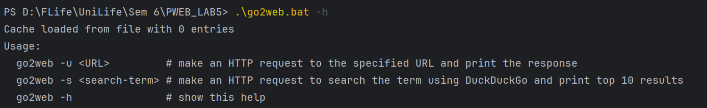
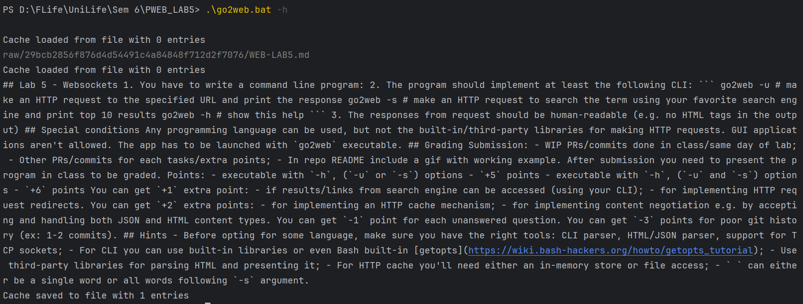
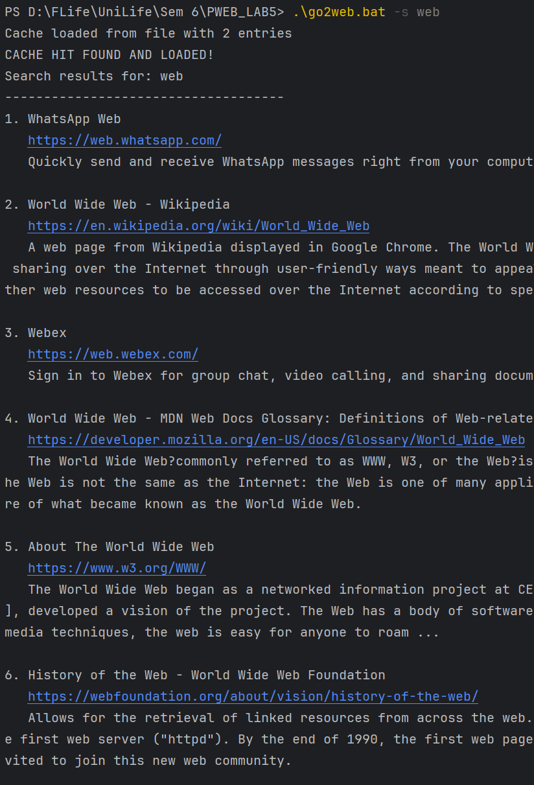
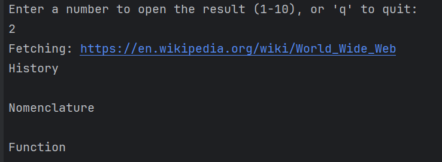

# Go2Web - Simple Command-Line Web Browser

Go2Web is a Java-based command-line web browser application that allows you to fetch web pages and search the internet using DuckDuckGo directly from your terminal.

## Features

- Make HTTP/HTTPS requests to any website and display readable content
- Search the web using DuckDuckGo and display the top 10 results
- Cache system for faster repeated requests (5-minute expiry)
- Support for redirects (up to 5 consecutive redirects)
- Automatic HTML content extraction and formatting
- JSON response formatting

## Prerequisites

- Java 16 or newer (required for Record types support)
- Windows, Linux, or macOS with a terminal

## Setup

1. Clone or download this repository to your local machine
2. Compile the Java code:
   ```
   javac Main.java
   ```
3. Run the batch file (Windows) or shell script (Linux/macOS) to use the application

## Usage

### Display Help

```
.\go2web.bat -h
```



This displays the available commands and their descriptions.

### Fetch a URL

```
.\go2web.bat -u example.com
```



The command fetches the content of the specified URL, parses the HTML, and displays the readable content. If you don't include the protocol (http:// or https://), https:// will be added automatically.

### Search the Web

```
.\go2web.bat -s search_term
```




This command:
1. Searches DuckDuckGo for the specified term
2. Displays the top 10 results with titles, URLs, and descriptions
3. Prompts you to select a result or quit
4. If you select a result, fetches and displays the content of that webpage

## How It Works

### HTTP/HTTPS Requests

Go2Web uses Java's socket API to make direct HTTP and HTTPS requests:
- For HTTP, it creates a standard Socket
- For HTTPS, it creates an SSLSocket using TLS
- Constructs proper HTTP request headers and handles responses

### Content Extraction

The application extracts readable content from HTML by:
1. Removing script, style, and other non-content elements
2. Extracting and formatting content from various HTML tags (title, headings, paragraphs, lists)
3. Handling HTML entities and special characters
4. Prioritizing content from article, main, and content-specific divs

### Caching

Go2Web implements a simple caching system:
- Responses are cached in memory for 5 minutes
- The cache is saved to a file ("go2web_cache.ser") between sessions
- Expired cache entries are automatically removed

### Search Functionality

The search feature:
1. Sends a query to DuckDuckGo's HTML search page
2. Parses the results using regex pattern matching
3. Extracts and displays the search results
4. Allows interactive selection of results

## File Structure

- `Main.java` - The main application code
- `go2web.bat` - Windows batch file for running the application
- `go2web_cache.ser` - Auto-generated cache file

## Troubleshooting

- If you get "ClassNotFoundException", make sure you've compiled the Java file and are running the command from the correct directory
- If you get SSL errors, ensure your Java installation has up-to-date security certificates
- If search results appear empty, DuckDuckGo may have changed their HTML structure

## Notes

- This application is for educational purposes and demonstrates direct socket programming in Java
- The HTML parsing is done using regex, which is not as robust as using a proper HTML parser library
- Performance may vary based on network conditions and website complexity